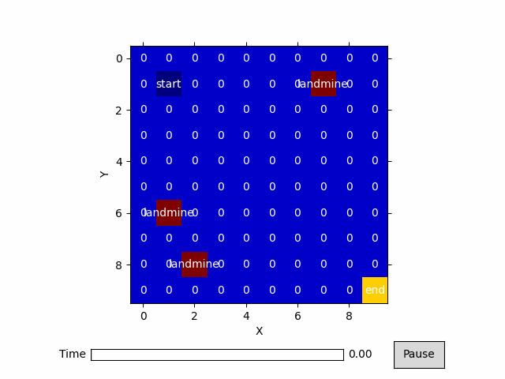

<h1 align="center"> Machine Learning Reinforcement Learning</h1>

<div align="center" >
  
  
  
  
</div>

## Table of Contents
* [Project Setup](#ProjectSetup)
* [Libraries Used](#libraries)
* [Future Scope](#FutureScope)
## Description 
*This is an implementation of two fundamental reinforcement learinging algorighms: Value Iteration and Q-Learning. The numpy library is also used to 
generate random choices with given probabilites simulating explorative and exploitative behaviour.*

## Value Iteration Demo
Here our agent is fully aware of its surroundings, acting in a fully observable Markov Decision Process (MDP) 


## Q-Learning Demo
Here our agent knows very little about its surroundings. In this algorithm the agent explores the gird world in a series of both random actions (explorative behaviour) and greedy actions (exploitative behaviour) until some path can be found.
The agent acts in a partially observable Markov Decision Process

  

## Project setup  
To run this project clone this repository in a folder on your local machine.
We first need to build our virtual environment and install a list of 
libraries our program needs to run. To do this, open a terminal in the root directory and run the following commands

```
make install       // installs program dependencies
```


Next we need to activate our virual environment. To do this run the following commands

```
source venv/bin/activate       // Activates our virtual environment
```

Now we can run either one of our algorithms. Run these commands and you will be provided with sample inputs to your file for each of the 
two algorithms

```
make runSampleValueIteration       // runs ValueIteration.py with sample arguments
```
or
```
make runSampleQLearning           //runs QLearning.py with sample arguments
```
Alternatively you can run each program program with your own arguments that follow the pattern 
```
python3 QLearning.py [-start startx starty] [-end endx endy] [-k numberofMines] [-gamma gamma]")
			                [-epochs epochs] [-learningRate learningRate]
```
To exit the virtual environment run:

```
deactivate       // runs the program
```
### Libraries Used
* Numpy


## Future Scope
* add the logic from this project to the pathfinding-visualizer project in my repo which can be found at
https://github.com/zmaqutu/3D-Pathfinding-Visualizer

* Use JavaScript/React to create better animations

<p align="center">Made with ❤️ with Pycharm and vim</p>


